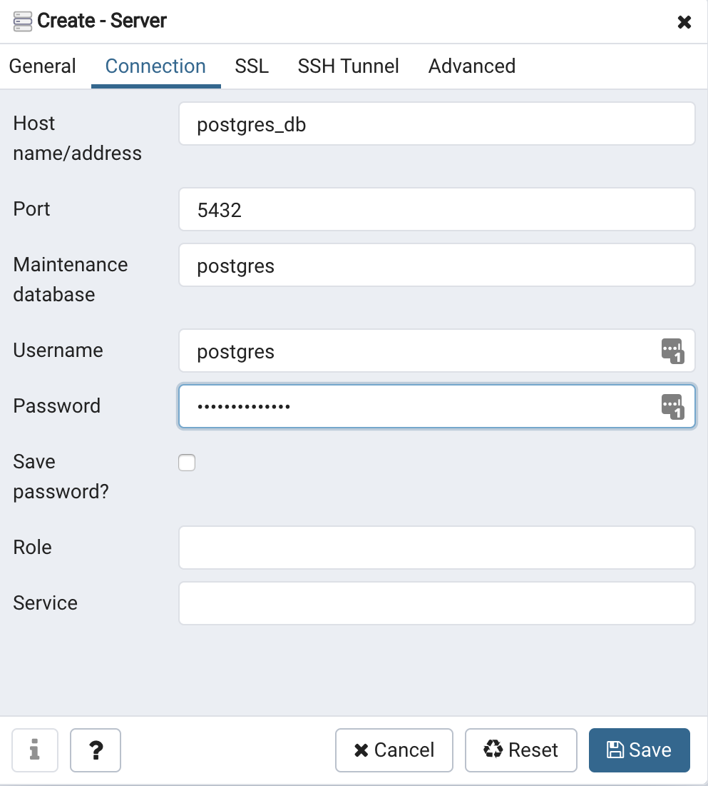
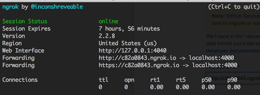

# Octo Events

Este projeto possui uma pasta chamada "docker", dentro desta tem um arquivo chamado docker-compose.yml que é responsável por construir o ambiente de desenvolvimento completo para o projeto.

# Instalar o Docker e Docker-Compose

Para utilizar o ambiente que foi projetado utilizando o docker, é necessário que tenha instalado em sua maquina o `docker` e `docker-compose`, assim, evitando quaisquer conflitos e dificuldades em executar o ambiente.

- [Instalar Docker](https://docs.docker.com/install/linux/docker-ce/ubuntu/#install-docker-ce)
- [Instalar Docker-Compose](https://docs.docker.com/compose/install/#install-compose)

# Utilizando o Docker

Ao clonar o projeto, basta acessar a pasta `docker` e executar o comando abaixo:

``
    $ docker-compose build
    $ docker-compose up -d
``

Após a execução do comando acima, seu ambiente estará pronto.

Os seguintes containers serão disponibilizados:

- application - Container da aplicação com Ruby e Ruby on Rails

# Executando o projeto dentro do container

Para acessar o ambiente de desenvolvimento dentro do Container, execute o seguinte comando:

``
    $ docker exec -it octo_events bash
``

* Instale as dependências da aplicação `` bundle install ``
* Execute os comandos para o rails preparar seu ambiente:
   `` $ bundle exec rake db:create ``
   
   `` $ bundle exec rake db:migrate ``
   
   `` $ bundle exec rake db:migrate RAILS_ENV = test ``
* Rode o servidor `` bundle exec puma -p 3000 ``
* Abra seu navegador `` http://localhost:3000 ``

# Banco de Dados

A aplicação utiliza o banco de dados Postgres, com isso, para uso do projeto é necessário 
a criação de um **Server** no PgAdmin, para isso siga os comandos abaixo:

* Acesse o seu [Pgadmin](http://0.0.0.0:16543) local;
* Para acessar, utilize os dados abaixo:
* Usuário: octo_events@gmail.com
* Senha: PgAdmin2019!

* Crie um server conforme imagem abaixo:

* Na aba Conecctions, crie uma conexão conforme imagem abaixo:

* Usuário: postgres
* Senha: Postgres2019!

# Tecnologias utilizadas

- Ruby 2.6.3
- Ruby on Rails 6.0.0
- Docker
- Docker Compose

## Webhook Endpoint

**Github Integration Instructions**

    * Suba o aplicativo Ngrok com o seguiunte comando abaixo:

   $ sudo ngrok http 3000 

   GitHub
   
    * No github, adicione a URL gerada no campo Payload

